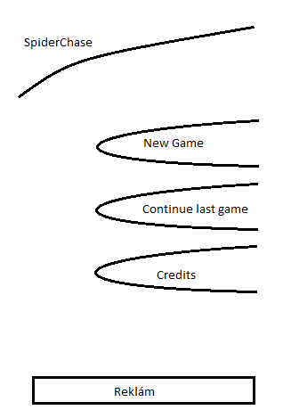

# SpiderChase

### Tartalom

* [Játék jelenetek](#jatek-jelenetek)
* [Logó jelenet](#logo-jelenet)
* [Főmenü jelenet](#fomenu)
* [Játékmenet](#jatekmenet)
* [Térkép jelenet](#terkep)
* [Pálya jelenet](#palya)

### Játék jelenetek

* Logó
* Főmenü
	* Új játék kezdése
	* Elkezdett játék folytatása
	* Credits
* Térkép
* Pálya
* Credits

### Logó jelenet

A logó jelenet elnyomhatatlan, és minden indításkor megjelenik két másodperc ideig.
Ezen jelenik meg az **Immortal Games** felirat.

A logó kinézete lehetne egyszerű nagy **I**, és nagy **G** betű mondjuk egy kőbe vésve.
Esetleg az I szárára függőlegesen az **"mmortal"**, ill. a G vízszintes szárára az **"ames"** felirattal.

*Animáció:*

Ha animálni szeretnénk, akkor lehetne mondjuk homokot lefújni a kőről...

### Főmenü
Itt meg kell jelenjen a játék neve, ill. a háttérben egy kép, amin az látható,
hogy a jó pók menekül a pókhálón egy, vagy két rossz pók elől.
A jó pók arcán láttszon a félelem, a rossz pók arcán meg az őrület.

*Layout:* 

*Megjelenés:*
Az egyes menüpontok kerete lehetne egy a körvonalon végigvezetett cylinder, ami alacsony fénnyel világítana, mint egy neoncső.
Ennek fénye a felirat hátterére is rávetülhetne.

*Animáció:*
A megjelenéskor a menüpontok egymás után jobbról becsúsznak a vízszintes tengely körül 90 fokkal elforgatva,
és becsúszás közben állandó sebességgel szembefordulnak velünk. A besúszás nem egyesével történik,
hanem időben átlapolva (monjuk 20% eltolással).

*Kiválasztás:*
A megérintett menüpont körvonala kifényesedik, ill. rögtön elkezdenek kicsúszni a menüpontok ugyanazzal az animációval,
amivel bejöttek. Viszont a kicsúszást mindenképpen kezdje a kiválasztott menüpont, és csak úgy kövesse a többi felülről lefelé.

*Effekt:*
Ha megérintjük a képernyőt, akkor az újjunk alatt megjelenhetne valamilyen fény, vagy akár elektromos kisülés.
Ezen felül itt is lehetne játszani a gép mozgatására az árnyékokkal 3D hatást keltve...

### Játékmenet

*Cél:*
Adott időn belül legalább 1x végigjárni a jó pókkal a pályán megjelenített pókhálót anélkül,
hogy elkapnának a rossz pókok (egy, vagy több).

*Értékelés:*
Maximum három csillag, a megmaradt befejezési időtől függően (30%, 20%, 10%).

*Életek száma:*
A játékban az életek száma mondjuk 9. (jelezhetjük 3 db 3 részből álló szívvel).
Ha a rossz pók elkap, vagy lejár az idő, akkor elveszítünk egyet.

Ha elfogynak az életeink, akkor ki kell várni egy kis időt, ameddig újratöltődnek, és folytathatjuk a játékot.
(Az időt ki lehet váltani reklám nézéssel, vagy pénz befizetéssel...)

*Szereplők:*
* *Jó pók:* kicsi aranyos pókocska, mosolygó barátságos arccal, nagy elesett szemekkel. Esetleg lehetne baseball spakája, és cipője a lábain :)
* *Rossz pók:* nagyseggű vörös-fekete koszos pók, mérges arccal, mélyvörös szemekkel.

*Térkép:*
A játék több helyszínre van osztva. Ezek lehetnének a következők első körben (mintha a kispók szeretne hazamenni az erdőbe):
*Raktáron belül
*Raktár udvar
*Raktár kapu
*Utca
*Erdő
*...

*Pályák:*
A pályák különféle módon lyukas pókhálókat jelenítenek meg. Ezeken kell végigmenni a kispókkal elkerülve a rossz pókokat.
A hálónak egy csomópontban maximum három irányú elágazása lehet (bal, egyenes, jobb).

*Irányítás:*
A kispók irányítása két kézzel történik a képernyő két oldalán elhelyezett irányító vezérlőkkel.

Bal oldalon négy gomb két sorban:
1. sor *(3 gomb balról jobbra sorban)*: ha bármelyiket nyomjuk, akkor halad a pók előre.
	* Fordulás balra a következő fordulónál.
	* Tovább előre.
	* Fordulás jobbra a következő fordulónál.
2. sor: megfordulás azonnal

Jobb oldalon 1 gomb: amíg nyomjuk, addig színezi a pók a hálót. Színezés közben lassabban halad, mint anélkül.
Ha nem színez, akkor a pók legyen kicsit gyorsabb, mint a rossz pókok.

*Ajándékok:*
A pályán a pókhálón játék közben megjelenhetnek különféle ajándékok,
amiket összeszedve extra képességekre tehetünk szert rövid időre.
Ezek lehetnek negatív képességek is.
A képességek lehetnek mondjuk:
* Gyorsabb sebességgű színezés/haladás
* Időmegállítás
* Plusz élet
* Lassabb sebesség :(
* Színezés invertálás (tehát az eddig kiszínezett részek lesznek a kiszínezés nélküli részek hirtelen)
* Rossz pókok lassítása, megállítása egy időre

### Térkép
TODO: ...

## Pálya
TODO: ...

